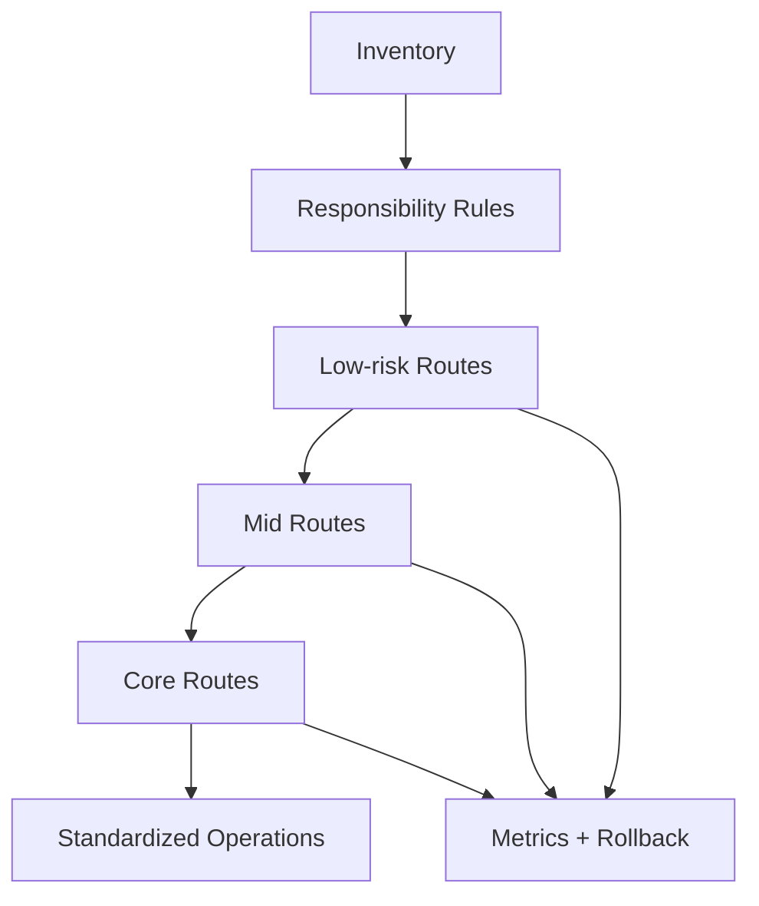

마이그레이션에서 가장 위험한 순간은 기술적으로 어려운 구간이 아닙니다. 보통은 "이제 감으로 넘어가도 되겠다"고 느끼는 순간입니다. React Router v6/Remix 기반 앱을 v7 + RSC 방향으로 전환할 때도 마찬가지입니다. 한 번에 갈아엎기보다, 경계 단위로 점진 전환해야 실패 비용을 통제할 수 있습니다.

이 글은 실무에서 실제로 적용 가능한 순서로 전환 전략을 정리합니다.

---

## 왜 점진 전환이어야 하는가

대부분의 팀은 아래 제약을 동시에 갖고 있습니다.

- 기능 개발은 멈출 수 없음
- 운영 장애 허용치가 낮음
- 팀별 숙련도 차이가 큼
- 데이터 경계가 이미 복잡함

이 상황에서 빅뱅 전환은 기술적으로 가능해도 운영적으로 실패할 확률이 높습니다. 점진 전환의 목적은 "느리게 가기"가 아니라 "가시성을 유지한 채 빠르게 반복하기"입니다.

---

## 1단계: 전환 전에 반드시 하는 인벤토리

코드를 건드리기 전에 다음을 문서화합니다.

1. 라우트 트리와 소유 팀
2. loader/action 사용 지점
3. 에러/로딩 경계
4. 전환 성능/장애 지표 기준선

여기서 기준선이 중요한 이유는, 전환 후 좋아졌는지/나빠졌는지를 객관적으로 판단해야 하기 때문입니다.

---

## 2단계: 데이터 책임 분리 규칙부터 고정

RSC 도입 자체보다 먼저 해야 할 일은 책임 규칙 합의입니다.

- 어떤 데이터는 RSC 소유로 이동하는가
- 어떤 데이터는 loader/action에 유지하는가
- action 이후 재검증 트리거는 누가 갖는가

이 규칙 없이 마이그레이션하면 중복 fetch와 stale 충돌이 반복됩니다.

---

## 3단계: 전환 순서 설계

권장 순서:

1. 트래픽 낮은 읽기 중심 라우트
2. 중간 복잡도 라우트
3. 뮤테이션/의존성 많은 핵심 라우트

이 순서의 이유:

- 초반 리스크 최소화
- 팀 학습을 다음 라우트에 반영
- 관측성 파이프라인 검증 후 확장

---

## 4단계: 기능 플래그 + 롤백 플랜

마이그레이션은 기능 릴리스가 아니라 운영 이벤트입니다.

필수 항목:

- feature flag 토글
- 즉시 롤백 경로
- 배포 전후 지표 자동 비교
- 장애 대응 채널/온콜 명시

롤백 플랜이 없으면 "되돌릴 수 없는 실험"이 됩니다.

---

## 5단계: 품질 게이트 설정

전환 PR에서 자동 검증할 항목을 정합니다.

- route transition latency 임계값
- 에러율 변화
- 번들 크기 변화
- 중복 요청 증가 여부

기술적으로 동작하는 것과 운영 품질이 유지되는 것은 다릅니다. 게이트가 있어야 회귀를 막습니다.

---

## 안티패턴

1. **"핵심 라우트부터" 접근**
   - 실패 반경이 너무 커 초기 신뢰를 잃음

2. **"문서 없이 코드 먼저" 접근**
   - 소유권 충돌로 속도 저하

3. **"롤백 없는 배포"**
   - 작은 문제도 대형 장애로 확산

4. **"지표 없는 성공 선언"**
   - 회귀를 늦게 발견

---

## 전환 상태 다이어그램

---

## 팀 체크리스트

- [ ] 라우트/소유권 인벤토리가 최신인가
- [ ] RSC vs loader/action 분리 규칙이 합의됐는가
- [ ] 단계별 전환 순서가 문서화됐는가
- [ ] 롤백 시나리오를 실제로 리허설했는가
- [ ] 전환 지표 대시보드가 있는가

---

## 마무리

v7 + RSC 전환의 핵심은 기술 교체가 아니라 운영 모델 전환입니다. 작은 단위로 옮기고, 책임을 명확히 하고, 측정 가능한 방식으로 확장하면 실패 비용을 크게 줄일 수 있습니다.

다음 글에서는 마지막으로 MFE 환경에서 Router + RSC를 조직 운영 패턴으로 정착시키는 방법을 다룹니다.
