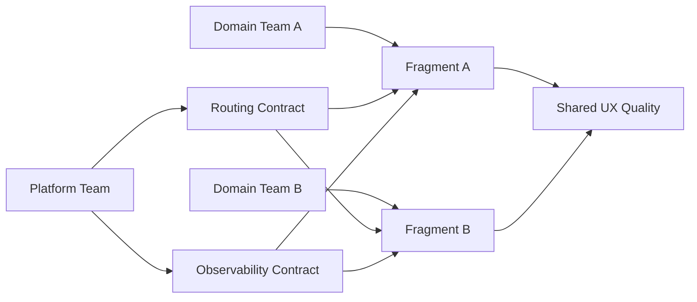

## 한눈에 보기

React Router 7 + RSC + MFE 조합의 핵심 난이도는 “기술 스택의 복잡성”이 아니라 “경계의 운영 가능성”입니다. 같은 프레임워크를 써도 한 조직은 릴리스를 안정적으로 누적하고, 다른 조직은 통합 시점마다 장애를 반복합니다. 차이는 코드 품질보다 경계 품질에서 발생합니다. 경계 품질은 다시 계약, 소유권, 관측성, 의사결정 루프로 환원됩니다.

이 글의 결론을 먼저 요약하면 다음과 같습니다.

- **RSC는 성능 기능이 아니라 책임 분리 장치**로 다뤄야 합니다.
- **React Router 7은 URL 매핑 도구가 아니라 운영 경계 제어면**으로 사용해야 합니다.
- **MFE는 독립 배포의 약속이 아니라 상호의존성 관리 체계**가 필요합니다.
- **Shell과 Fragment의 권한을 모호하게 두는 순간 장애 원인 분석 비용이 기하급수로 증가**합니다.
- **운영 성공의 단위는 기능 출시 속도가 아니라 변경 실패율·복구 시간·재발률**입니다.

따라서 “어떻게 구현할까”보다 먼저 “누가 무엇을 결정하고, 무엇을 책임지며, 어떤 지표로 되돌아볼 것인가”를 정의해야 합니다. 특히 30인 규모 전후의 팀에서 MFE 전환을 진행할 때, 기술 도입보다 운영 모델의 성숙도를 먼저 끌어올리지 않으면 라우터와 RSC는 생산성 도구가 아니라 복잡도 증폭기로 작동합니다.

---

## 들어가며

React Router 7과 RSC를 함께 도입할 때 많은 팀이 “렌더링 성능”과 “개발자 경험”에 집중합니다. 물론 중요한 포인트입니다. 그러나 MFE 환경에서는 이 두 가지가 **결과 변수**에 가깝습니다. 실제로 시스템 안정성과 팀 확장성을 결정하는 것은 **운영 구조 변수**입니다.

MFE는 본질적으로 경계가 많은 아키텍처입니다. 팀 경계, 코드 경계, 배포 경계, UX 경계가 이미 존재합니다. 여기에 RSC를 추가하면 서버/클라이언트 경계가 하나 더 생깁니다. 문제는 경계 자체가 아닙니다. 경계가 많아졌는데 경계의 규칙이 빈약할 때 실패합니다. 즉, 운영 난이도 급상승의 원인은 “기술이 어렵다”가 아니라 “경계의 사회적 계약이 없다”입니다.

React Router 7이 이 상황에서 중요한 이유는 명확합니다. 라우터는 사용자의 이동 경로를 정의할 뿐 아니라, 실제로는 **팀 간 책임의 흐름**을 정의합니다. 어떤 URL을 누가 소유하는지, 에러가 어디에서 흡수되는지, 로딩 상태를 누가 보장하는지, 데이터 재검증 트리거가 어떤 맥락에서 발생하는지 모두 라우팅 구조와 결합됩니다. RSC 또한 마찬가지입니다. 서버에서 읽고, 클라이언트에서 상호작용하고, 다시 서버로 쓰기 요청을 보내는 과정은 “성능 최적화 기법”이 아니라 “책임의 왕복 경로”입니다.

따라서 운영 패턴 정착의 출발점은 다음 질문입니다.

1. 이 경계는 누구의 소유인가?
2. 이 경계는 어떤 계약으로 보호되는가?
3. 경계 위반이 발생했을 때 누구가 어떤 순서로 판단하는가?
4. 판단의 근거 데이터는 어디에 기록되는가?

이 질문에 답하지 못하면 기술 부채가 아니라 **운영 부채**가 누적됩니다. 운영 부채의 특징은 코드 리뷰로는 발견하기 어렵고, 장애 시점에만 비용이 폭발한다는 점입니다. 그래서 처음부터 설계 의도를 운영 언어로 번역해야 합니다.

---

## 트레이드오프

아래 내용은 “정답”이 아니라, React Router 7 + RSC + MFE 조합에서 반복적으로 마주치는 선택지와 그 비용 구조를 정리한 것입니다. 핵심은 기능 추가보다 **불확실성의 위치를 줄이는 방향**으로 결정하는 것입니다.

### 1) Shell 중심 통제 vs Fragment 중심 자율성

MFE에서 가장 먼저 부딪히는 선택은 통제권의 배분입니다. Shell이 정책을 강하게 통제하면 UX 일관성과 운영 표준 준수율은 높아집니다. 반면 도메인 팀의 실험 속도는 떨어지고, 변경 요청이 중앙 병목으로 몰립니다. 반대로 Fragment 자율성을 극대화하면 팀별 속도는 오르지만, 로깅 스키마·에러 처리·로딩 UX가 분열되어 사용자 경험이 서비스마다 다른 제품처럼 보이기 시작합니다.

이 트레이드오프를 푸는 실무적 방법은 “권한 위임”이 아니라 “권한 계층화”입니다.

- **Shell 고정 영역(강제):**
  - URL 전역 규약
  - 인증/권한 게이트 정책
  - 공통 에러 등급 체계
  - 운영 로그 스키마
- **Fragment 자율 영역(선택):**
  - 도메인 내부 라우팅 흐름
  - 세부 UX fallback 표현
  - 도메인 특화 캐시 전략
  - 실험성 상호작용 패턴

즉, 중앙은 “일관성의 최소 조건”만 강제하고, 도메인은 “사용자 가치와 연관된 차별성”을 소유하는 구조가 바람직합니다. 이때 중요한 것은 문서의 길이가 아니라 경계의 판별 가능성입니다. 리뷰어가 PR 하나만 보고도 “이 변경은 Shell 승인 대상인지 Fragment 자율 변경인지”를 즉시 판단할 수 있어야 합니다.

### 2) 데이터 접근 자유 vs 데이터 소유권 명시

RSC 도입 초기에는 데이터 접근을 최대한 개방하는 편이 개발 속도에 유리해 보입니다. 하지만 MFE에서 이는 빠르게 충돌을 만듭니다. 동일 리소스를 여러 Fragment가 읽고 쓰기 시작하면 재검증 타이밍이 서로 꼬이고, “누가 데이터 정합성을 책임지는가”가 사라집니다.

그래서 리소스마다 최소 4가지 소유권을 명시해야 합니다.

- **Read owner**: 어디에서 읽기를 표준으로 할 것인가(RSC/loader 등)
- **Write owner**: 쓰기 권한과 검증 책임은 누가 가지는가(action 등)
- **Revalidation owner**: 어떤 변경이 어떤 경로를 재검증시키는가
- **Fallback owner**: 실패 시 사용자에게 무엇을 보장할 것인가

여기서 설계 의도는 통제가 아닙니다. **경로 축소**입니다. 장애 상황에서 선택지를 줄여야 빠르게 복구할 수 있기 때문입니다. “다들 어느 정도 알고 있는 상태”는 평시에는 유연해 보이지만, 장애 시에는 책임 공백으로 바뀝니다.

### 3) 표준 최소화 vs 품질 분산

“가드레일을 적게 두면 팀이 빨라진다”는 주장은 초기에는 사실입니다. 그러나 팀 수가 늘어나면 표준 없는 자율성은 품질 분산을 낳고, 결국 통합 비용이 기능 개발 비용을 넘어섭니다. React Router 7 + RSC 조합에서는 특히 다음 표준이 없을 때 피해가 큽니다.

- route naming 규칙
- boundary 인터페이스(입력/출력/실패 시나리오)
- logging schema(운영 로그 필드)
- transition 성능 측정 규격
- rollback playbook 템플릿

핵심은 표준의 “양”이 아니라 “복구 친화성”입니다. 표준이 팀을 통제하기 위한 문서가 아니라, 장애를 줄이고 복구 시간을 단축하기 위한 도구라는 공감이 있어야 지속됩니다.

### 4) 큰 설계 일괄 적용 vs RFC 기반 점진 진화

대규모 전환에서 자주 발생하는 실수는 아키텍처 결정을 “한 번에 끝내려는 시도”입니다. MFE + RSC는 실제 트래픽과 조직 습관이 반영되어야 안정됩니다. 따라서 설계는 정답 탐색보다 **실험 가능한 가설 운영**이 되어야 합니다.

권장 루프는 단순합니다.

1. 경계 변경 제안(RFC)
2. 관련 소유팀 합의
3. 제한 트래픽 실험
4. 운영 지표 검증
5. 표준 반영 또는 폐기

이 루프의 장점은 기술적 리스크보다 사회적 리스크를 줄여준다는 점입니다. 팀이 설계 변경을 “지시”로 받지 않고 “검증 가능한 제안”으로 받아들이게 됩니다. 결국 운영 모델은 기술이 아니라 합의 프로토콜입니다.

### 5) 기술 로그 중심 vs 운영 로그 중심

대부분의 팀은 로그를 충분히 쌓고 있다고 생각합니다. 하지만 장애 회고에서 “그래서 누가 무엇을 언제 결정해야 했는가”를 답하지 못하면, 로그는 많아도 운영 정보는 부족한 상태입니다. React Router 7 + RSC + MFE에서는 로그가 최소한 아래 맥락을 담아야 합니다.

- routeId
- fragmentId
- ownerTeam
- sourcePath(RSC/loader/action)
- boundaryId
- revalidationReason
- userImpactScope

이 필드들의 목적은 디버깅 편의가 아니라 **의사결정 재현성**입니다. 같은 문제가 다시 발생했을 때, 과거의 판단이 왜 내려졌는지 재구성할 수 있어야 재발률이 줄어듭니다.

아래는 개념 예시입니다. 코드 형태는 참고용이며, 실제로 중요한 것은 필드 통일입니다.

```ts
type OpsEvent = {
  routeId: string;
  fragmentId: string;
  ownerTeam: string;
  sourcePath: "rsc" | "loader" | "action";
  boundaryId: string;
  revalidationReason?: string;
  userImpactScope: "single" | "segment" | "global";
  ts: string;
};
```

### 6) 코드 경계와 팀 경계의 불일치

아키텍처 다이어그램이 깔끔해도 팀 구조와 맞지 않으면 운영은 병목으로 돌아갑니다. 예를 들어 route 경계는 도메인 단위로 나뉘어 있는데, 배포 권한은 중앙 팀만 가지고 있다면 실질적으로는 모놀리식 운영과 다르지 않습니다. 반대로 배포는 분산했는데 장애 대응 책임이 불명확하면 롤백 의사결정이 지연됩니다.

정렬 원칙은 세 가지입니다.

- **소유권 경계 = 라우트/프래그먼트 경계**
- **릴리스 권한 = 소유 책임**
- **의존성 지도 = 명시적 관리 대상**

이 정렬이 되면 기술 독립성이 운영 독립성으로 이어집니다. 정렬이 안 되면 기술적 모듈화는 존재하지만, 의사결정은 중앙집중으로 회귀합니다.

### 7) 실패 패턴을 운영 규칙으로 환원하기

실패를 사고 보고서로만 남기면 다음 릴리스에서 반복됩니다. 실패를 “운영 규칙”으로 바꾸는 것이 중요합니다.

- **패턴 A: Shell 정책 독점**
  - 증상: 도메인 팀 대기열 증가, 릴리스 지연
  - 규칙: Shell은 정책 프레임만 소유, 도메인 UX 판단은 위임
- **패턴 B: Fragment 표준 무시**
  - 증상: 사용자 경험 단절, 운영 지표 비교 불가
  - 규칙: 공통 스키마 위반은 코드 품질 이슈가 아니라 운영 이슈로 승격
- **패턴 C: 문서 없는 확장**
  - 증상: 장애 때 책임 공백, 복구 지연
  - 규칙: 경계 변경은 PR 승인 외 RFC 승인 필수

운영 성숙도는 장애가 없는 상태가 아니라, 장애에서 학습한 규칙이 다음 분기에 실제로 적용되는 상태입니다.

### 8) React Router 7 + RSC 관점에서 “왜”를 놓치지 않는 법

이 조합을 채택하는 이유를 기술 기능으로만 서술하면 금방 흔들립니다. 조직이 유지해야 할 설계 의도는 아래와 같습니다.

- React Router 7의 목적은 페이지 이동이 아니라 **경계 선언의 일관화**입니다.
- RSC의 목적은 서버 렌더링 최적화가 아니라 **읽기 책임의 명료화**입니다.
- MFE의 목적은 팀 독립성이 아니라 **독립성과 전체 품질의 동시 확보**입니다.

즉, 셋을 합친 아키텍처의 본질은 “자율성과 일관성의 동시 달성”입니다. 이 목표가 문서와 지표에 명시되지 않으면, 각 팀은 자기 최적화로 흩어지고 전체 시스템은 운영적으로 취약해집니다.

### 9) 운영 다이어그램을 문서가 아니라 행동 규칙으로 쓰기

아래 같은 다이어그램은 설명용이 아니라, 책임 경로의 합의문이어야 합니다.



여기서 핵심은 Platform 팀이 구현을 대신하는 조직이 아니라, **계약을 관리하는 조직**이라는 점입니다. 도메인 팀은 기능을 만들고, 플랫폼 팀은 기능들이 함께 작동할 수 있는 규칙을 유지합니다. 이 역할 분리가 선명할수록 조직의 확장성이 올라갑니다.

### 10) 운영 체크리스트는 배포 전 검증이 아니라 조직 정렬 도구

다음 체크리스트는 형식 문서가 아니라, “운영 정렬 회의”에서 사용하는 질문지로 작동해야 합니다.

- [ ] Shell/Fragment 책임 계약이 문서화되어 있는가
- [ ] 리소스 단위 소유권(읽기/쓰기/재검증/복구)이 명시되어 있는가
- [ ] RFC 루프가 실제 트래픽 실험과 연결되어 있는가
- [ ] 운영 로그 필드가 의사결정 재현에 충분한가
- [ ] 팀 경계와 라우트 경계가 정렬되어 있는가
- [ ] 롤백 플레이북을 리허설했는가

이 질문에 “예”라고 답하는 비율이 높아질수록, 신규 기능 속도보다 중요한 **변경 안전성**이 향상됩니다.

---

## 마무리하며

React Router 7 + RSC + MFE를 성공시키는 팀은 보통 기술적으로 더 뛰어난 팀이 아닙니다. 대신 경계를 설계하고, 소유권을 명시하고, 실패를 학습 루프로 환원하는 팀입니다. 즉, 구현 역량보다 운영 역량이 승부를 가릅니다.

정리하면 다음과 같습니다.

- **RSC는 렌더링 기술이면서 동시에 책임 배치 기술**입니다.
- **React Router 7은 경로 매핑 도구이면서 동시에 조직 경계의 실행 계층**입니다.
- **MFE는 독립 배포 전략이면서 동시에 상호의존성 통제 전략**입니다.

이 세 가지가 정렬되면, 팀 규모가 커져도 품질이 유지됩니다. 반대로 하나라도 빠지면, 초기 생산성은 높아 보여도 시간이 지날수록 통합 비용과 장애 비용이 누적됩니다. 결국 장기적으로 이기는 방법은 화려한 아키텍처보다 단단한 운영 모델입니다.

시리즈의 마지막 메시지는 단순합니다.  
**구현은 출발점이고, 운영이 완성도입니다.**  
React Router 7 + RSC는 도구가 아니라 약속입니다. 그 약속을 팀이 어떻게 지키는지에 따라 MFE의 미래가 결정됩니다.

---

## 더 읽어볼 자료

아래 자료들은 “기능 사용법”보다 “설계 의도와 운영 맥락”을 함께 이해하는 데 도움이 되는 순서로 정리했습니다.

1. React Router 공식 문서  
   - 라우팅 모델, 데이터 흐름, 경계 설계 관점을 확인할 수 있습니다.

2. React 공식 문서의 Server Components 관련 설명  
   - 서버/클라이언트 책임 분리에 대한 철학과 제약을 이해하는 데 유용합니다.

3. Micro Frontends 관련 아키텍처 글(ThoughtWorks Technology Radar, Martin Fowler 등)  
   - 팀 경계와 배포 경계를 기술 구조에 매핑하는 사고방식을 보완할 수 있습니다.

4. Team Topologies  
   - 코드 구조와 팀 구조의 정렬 문제를 운영 관점에서 다루는 데 적합합니다.

5. Accelerate / DORA 지표 관련 자료  
   - 변경 실패율, 복구 시간, 배포 빈도를 운영 성숙도의 공통 언어로 정리할 수 있습니다.

6. RFC 문화와 ADR(Architecture Decision Record) 실무 사례  
   - 설계 결정을 문서로 남기고 조직 학습으로 연결하는 프로세스를 정착시키는 데 도움이 됩니다.

실무에서는 “많이 아는 것”보다 “같이 판단할 수 있는 공통 언어”가 더 중요합니다. 위 자료를 팀 규약으로 번역해 두면, React Router 7 + RSC + MFE는 단발성 도입이 아니라 지속 가능한 운영 자산으로 남게 됩니다.
