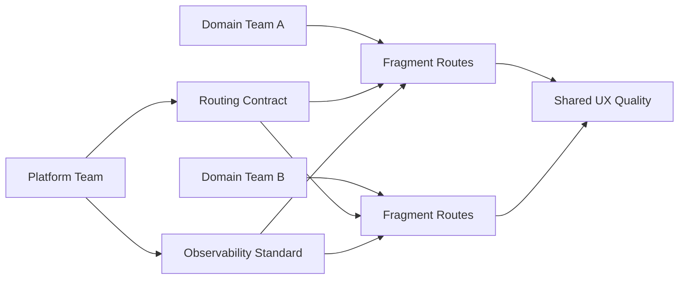

기술은 결국 운영으로 증명됩니다. React Router v7 + RSC도 마찬가지입니다. 데모에서는 잘 동작하지만, 여러 팀이 동시에 개발하고 배포하는 MFE 환경에서는 경계와 소유권이 불명확하면 빠르게 불안정해집니다.

이 글은 "어떻게 구현할까"보다 "어떻게 굴릴까"에 집중합니다.

---

## 왜 MFE에서 Router + RSC가 더 어렵나

MFE는 구조적으로 경계가 많습니다.

- 팀 경계
- 배포 경계
- 데이터 경계
- 책임 경계

RSC까지 더해지면 서버/클라이언트 경계도 추가됩니다. 경계가 많아질수록 문제가 늘어나는 게 아니라, **경계 간 계약 비용**이 급증합니다.

---

## 1) Shell vs Fragment 책임 분리

가장 먼저 정해야 할 것은 역할입니다.

### Shell 책임

- 전역 URL 계약
- 인증/권한 게이트
- 공통 에러/로딩 정책
- 공통 관측성(로그/트레이스/지표)

### Fragment 책임

- 도메인 내부 라우트
- 도메인 데이터 경계
- 도메인 특화 UX

이 분리가 없으면 장애가 났을 때 "누가 고칠지"부터 길어집니다.

---

## 2) 데이터 소유권 계약

RSC, loader, action이 섞인 환경에서는 "데이터를 누가 소유하는가"를 명시하지 않으면 충돌이 반복됩니다.

리소스별로 최소한 아래를 고정합니다.

- Read owner
- Write owner
- Revalidation owner
- Fallback owner

이 계약은 기술 문서이면서 운영 계약입니다.

---

## 3) 플랫폼 가드레일

자율성을 유지하려면 공통 규격이 있어야 합니다.

플랫폼 팀이 강제할 최소 항목:

- 라우트 네이밍/구조 규칙
- ErrorBoundary 인터페이스
- Pending UI 패턴
- transition 지표 수집 포맷

가드레일 없이 자율성만 주면 팀별 구현 편차가 커지고, 결국 통합 비용이 더 커집니다.

---

## 4) 의사결정 루프 (RFC 기반)

경계 변경은 코드 변경보다 리스크가 큽니다.
권장 루프:

1. RFC 제안 (변경 이유, 영향 범위, 롤백)
2. 소유팀 리뷰
3. 제한된 경로에서 실험
4. 지표 검증
5. 표준 반영

이 루프가 있어야 "개별 최적화"가 "조직 최적화"로 연결됩니다.

---

## 5) 관측성: 경계 문제를 숫자로 보기

MFE + Router + RSC 조합에서 꼭 필요한 로그 필드:

- route id
- owner team
- data path (RSC/loader/action)
- revalidation reason
- boundary id

이 필드가 없으면 회고가 감정 기반으로 흘러갑니다.

---

## 운영 다이어그램

---

## 실패 패턴

1. **Shell이 모든 걸 소유하려는 구조**
   - 도메인 팀 병목 증가

2. **Fragment가 전역 정책을 무시하는 구조**
   - 사용자 경험 일관성 붕괴

3. **소유권 문서 없는 확장**
   - 장애 시 책임 공백

4. **지표 없이 "느낌"으로 튜닝**
   - 품질 회귀 반복

---

## 최종 체크리스트

- [ ] Shell/Fragment 책임이 문서로 합의됐는가
- [ ] 리소스별 소유권 계약이 존재하는가
- [ ] Error/Pending 패턴이 공통 규격인가
- [ ] route transition 지표가 팀 공통으로 수집되는가
- [ ] 경계 변경 시 RFC 루프가 작동하는가

---

## 시리즈 결론

RSC 시대의 React Router v7은 단순 라우팅 라이브러리가 아니라, **운영 가능한 경계 전략**입니다. 기술을 도입하는 것만으로는 충분하지 않고, 팀 운영 모델과 함께 설계해야 실제 품질이 올라갑니다.

이 시리즈의 핵심 메시지는 하나입니다.

> RSC는 렌더링 전략이고, Router는 경계 전략이며, 성공은 운영 모델에서 결정됩니다.
