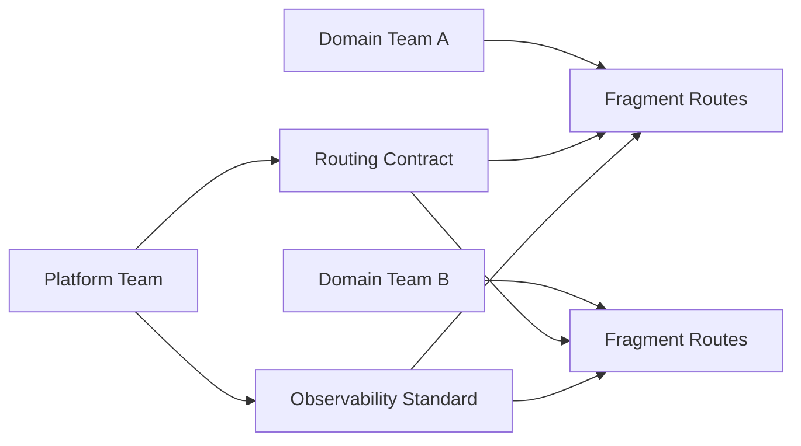

## 한눈에 보기

- React Router 7 + RSC를 조직에 정착시키는 핵심은 기술 스택이 아니라 **경계 운영 모델**입니다.
- 30인 규모 MFE 조직에서는 Shell/Fragment 책임 분리, 데이터 소유권 계약, 공통 가드레일, 의사결정 루프가 반드시 함께 설계되어야 합니다.
- 장애의 대부분은 코드 결함보다도 “누가 무엇을 책임지는지 불명확함”에서 발생합니다.
- RSC는 렌더링을 빠르게 만들 수 있지만, 운영 계약이 없으면 캐시/재검증/에러 복구가 오히려 더 복잡해집니다.
- 실무에서는 “기능 출시 속도”보다 “변경 안전성”을 KPI로 삼아야 장기적으로 성과가 납니다.

---

## 들어가며

React Router 7 + RSC 실무 운영을 시작하면 화면 렌더링 방식, 데이터 페칭 경계, 캐시 전략, 실패 복구 방식이 동시에 바뀝니다. 문제는 기술 문서만으로는 팀이 같은 방향으로 움직이지 않는다는 점입니다. 특히 MFE 전환기 조직에서는 라우팅을 담당하는 팀, 도메인 기능을 개발하는 팀, 플랫폼 표준을 유지하는 팀이 서로 다른 목표를 갖고 움직이기 쉽습니다.

이 글은 “어떤 API를 써야 하는가”보다 “어떤 운영 계약을 먼저 합의해야 하는가”에 집중합니다. 실무에서 겪는 대부분의 충돌은 코드 레벨이 아니라 경계 레벨에서 발생하기 때문입니다. 같은 URL을 누가 소유하는지, 재검증 시점은 누가 결정하는지, 장애가 났을 때 어떤 순서로 복구하는지 같은 질문이 선행되지 않으면, React Router 7 + RSC는 성능 개선 대신 운영 복잡도만 늘릴 수 있습니다.

결론부터 말하면, 이 조합을 성공시키는 방법은 간단합니다. 기술을 도입하는 것이 아니라 운영 모델을 먼저 고정하는 것입니다. 운영 모델이 선행되면 구현은 표준화되고, 표준화가 되면 팀 자율성이 오히려 커집니다. 결국 React Router 7 + RSC 실무 운영의 승패는 프레임워크 지식이 아니라 운영 계약의 정밀도에서 갈립니다.

---

## 본문

### 문제: 왜 Router + RSC 도입 후 조직이 더 느려지는가

도입 초기에는 대개 비슷한 일이 반복됩니다.

첫째, Shell이 너무 많은 책임을 가져갑니다. 공통 레이아웃, 인증, 전역 에러, 추적 로깅까지는 당연하지만, 도메인 라우트의 내부 전환 정책까지 Shell에서 결정하려고 하면 병목이 생깁니다.

둘째, Fragment 팀이 지나치게 독립적으로 움직입니다. 각 팀이 자체 Pending UI, 자체 에러 처리, 자체 캐시 무효화 규칙을 만들면 개별 팀 속도는 빨라 보이지만, 사용자 경험은 제품 단위로 일관성을 잃습니다.

셋째, RSC와 loader/action의 혼용 구간에서 데이터 소유권이 불분명해집니다. 같은 데이터를 서버 컴포넌트에서 읽고, 클라이언트 상호작용에서 다시 action으로 수정하는데, 재검증 트리거가 서로 달라 stale UI가 자주 발생합니다.

넷째, 장애 대응의 기준이 없습니다. 어떤 팀은 캐시를 우선 비우고, 어떤 팀은 fallback을 먼저 띄우고, 어떤 팀은 API 재시도를 늘립니다. 결과적으로 장애 복구 시간보다 장애 판단 시간이 더 길어집니다.

즉, 기술 난이도보다 운영 난이도가 먼저 폭증합니다. 이때 필요한 것은 더 많은 규칙이 아니라 더 명확한 책임 경계입니다.

### 원인: 경계를 코드로만 보고 계약으로 보지 않는 관성

MFE 조직에서 가장 흔한 착각은 “라우팅은 프론트엔드 구현 상세”라는 생각입니다. 그러나 React Router 7 + RSC에서는 라우팅이 곧 팀 간 계약입니다. URL은 사용자 약속이고, 데이터 경계는 장애 범위를 결정하며, 재검증 타이밍은 성능과 정확성의 균형을 좌우합니다.

문제가 반복되는 구조적 원인은 다음과 같습니다.

- 조직 경계와 코드 경계가 일치하지 않습니다.
- 배포 단위는 분리되어 있는데 운영 기준은 단일 문서로 관리되지 않습니다.
- 성능 지표는 있는데 실패 지표가 없습니다.
- RFC는 있으나 승인 기준이 모호하여 사실상 의견 교환으로 끝납니다.

여기서 중요한 포인트는 “좋은 코드”가 아니라 “예측 가능한 운영”입니다. 기능 하나를 빠르게 출시하는 것보다, 팀 5개가 동시에 변경해도 깨지지 않는 시스템을 만드는 것이 훨씬 큰 가치입니다.

### 원리: Shell/Fragment/Platform의 3층 계약 모델

React Router 7 + RSC를 운영 모델로 정착시키려면 3층 계약을 명문화해야 합니다.

#### 1) Shell 계약: 전역 안정성의 소유자

Shell은 전역 사용자 경험을 지키는 최종 경계입니다.

- 전역 URL 계약: 루트 세그먼트, 권한 기반 리다이렉트, 공통 파라미터 규칙
- 공통 프레임: 레이아웃 슬롯, 글로벌 내비게이션, 인증 게이트
- 전역 실패 정책: 라우트 미스매치, 인증 실패, 치명 오류 fallback
- 공통 관측성: trace id 주입, 라우트 전환 이벤트, 에러 분류 체계

Shell은 “무엇이든 제어”가 아니라 “전역 일관성을 보장”해야 합니다. 도메인 상세 UX까지 가져가면 Shell은 곧 조직 병목이 됩니다.

#### 2) Fragment 계약: 도메인 자율성의 소유자

Fragment는 도메인 문제를 가장 잘 아는 팀이 책임집니다.

- 도메인 내부 라우트 전환 정책
- 도메인 데이터 읽기/쓰기 경계
- 도메인 특화 Pending/Error UX
- 도메인 SLA에 맞는 재시도/복구 전략

핵심은 자율성과 독립성이 아니라 “계약된 자율성”입니다. Shell 계약과 충돌하지 않는 범위 안에서 최대한 자유롭게 실험하고 최적화해야 합니다.

#### 3) Platform 계약: 가드레일의 소유자

Platform 팀은 기능을 직접 만들지 않지만, 실패 확률을 줄이는 공통 규격을 소유합니다.

- 라우트 네이밍/폴더 컨벤션
- ErrorBoundary 인터페이스와 에러 코드 체계
- Pending UI 토큰(스켈레톤/스피너/타임아웃 문구)
- 전환 성능 지표와 장애 지표의 수집 포맷
- 배포 전 검증 체크(계약 위반 탐지)

가드레일은 창의성을 제한하려는 장치가 아니라, 팀마다 같은 실수를 반복하지 않게 만드는 조직 메모리입니다.

### 운영: 실무에서 바로 적용하는 6단계 정착 루프

운영 모델은 문서만으로 정착되지 않습니다. 실행 루프가 필요합니다.

#### 1단계. 경계 카탈로그를 먼저 만든다

각 라우트를 코드가 아니라 운영 관점으로 목록화합니다.

- owner team
- 데이터 원천(Source of Truth)
- 재검증 트리거
- 실패 시 fallback 우선순위
- 관측 지표(성능/장애)

이 카탈로그가 있어야 분쟁이 생겼을 때 “누가 맞는가”가 아니라 “무엇이 계약인가”로 대화가 전환됩니다.

#### 2단계. 데이터 소유권 계약을 도메인별로 고정한다

RSC와 action을 함께 쓰는 환경에서는 특히 아래 네 가지를 문서로 고정해야 합니다.

- 읽기 권위: 최종 값을 어디서 신뢰할 것인지
- 쓰기 권위: 어떤 경로가 상태를 변경할 수 있는지
- 재검증 트리거: 어떤 이벤트에서 어떤 범위가 갱신되는지
- 캐시 무효화 책임: 실패했을 때 누가 어떤 순서로 조치하는지

문서가 없으면 같은 버그가 팀마다 다른 이름으로 반복됩니다.

#### 3단계. 공통 실패 시나리오를 먼저 테스트한다

신규 기능 테스트보다 먼저 해야 할 것은 실패 테스트입니다.

- Fragment API 지연(2~5초)
- 부분 실패(하위 위젯만 오류)
- 인증 만료 중 전환
- 재검증 경쟁 상태(동시 액션)

이 시나리오를 플랫폼 공통 테스트로 만들면, 팀별 구현이 달라도 사용자 체감 품질은 안정적으로 유지됩니다.

#### 4단계. 의사결정 루프를 “실험-지표-표준”으로 단순화한다

권장 루프는 다음과 같습니다.

1. RFC 제출: 경계 변경 이유와 리스크를 명시합니다.
2. 소유팀 리뷰: Shell/Fragment/Platform 관점에서 계약 충돌을 검토합니다.
3. 실험 라우트 적용: 트래픽 일부 또는 내부 환경에 우선 배포합니다.
4. 지표 검증: 성능과 장애 지표를 함께 확인합니다.
5. 표준 반영: 가드레일 문서와 템플릿을 업데이트합니다.

이 루프의 목적은 승인을 받는 것이 아니라, 조직 학습을 축적하는 것입니다.

#### 5단계. 운영 지표를 “속도”와 “안전”으로 분리한다

실무에서 자주 놓치는 부분입니다. 페이지 전환 속도만 보면 시스템이 좋아진 것처럼 보입니다. 하지만 운영 품질은 실패 지표를 같이 봐야 드러납니다.

권장 최소 지표는 다음과 같습니다.

- p95 라우트 전환 시간
- 사용자 가시 에러율
- 재검증 후 stale UI 노출 비율
- 장애 감지부터 복구까지의 평균 시간(MTTR)
- 계약 위반 배포 건수

속도 지표와 안전 지표를 분리하면, “빠르지만 자주 깨지는 시스템”을 조기에 식별할 수 있습니다.

#### 6단계. 릴리스 체크리스트를 사람 의존에서 자동화로 옮긴다

운영 모델은 반복될 때 힘을 발휘합니다. 반복 가능한 항목은 CI로 옮겨야 합니다.

```yaml
# 예시: 계약 검증 체크(개념 예시)
checks:
- route-contract-diff
- error-boundary-interface
- pending-ui-token-usage
- observability-event-schema
- ownership-metadata
```

코드보다 중요한 것은 “위반을 자동으로 잡아내는 구조”입니다. 그래야 팀이 늘어나도 품질이 선형으로 무너지지 않습니다.

### 운영 다이어그램



위 구조에서 핵심은 Platform이 구현을 대신하는 것이 아니라, 계약과 관측 표준을 제공한다는 점입니다. Domain 팀은 기능 속도를 유지하면서도 같은 운영 언어를 사용하게 됩니다.

---

## 트레이드오프

React Router 7 + RSC 운영은 만능 해법이 아닙니다. 어떤 선택에도 비용이 있습니다. 중요한 것은 비용을 숨기지 않고 관리 가능한 형태로 드러내는 것입니다.

### 1) 중앙 표준 강화 vs 팀 자율성

- 중앙 표준을 강화하면 품질 편차는 줄지만, 초기 개발 속도는 떨어질 수 있습니다.
- 팀 자율성을 높이면 실험은 빨라지지만, 장기적으로 경험 불일치와 운영 부채가 커질 수 있습니다.
- 실무 권장점은 “필수 표준 최소화 + 선택 확장 허용”입니다.

### 2) RSC 우선 전략 vs 클라이언트 상호작용 민첩성

- RSC 비중을 높이면 초기 로딩 체감은 개선되지만, 복잡한 클라이언트 상호작용에서는 경계 설계가 어려워집니다.
- 클라이언트 중심으로 두면 상호작용 구현은 빠르지만, 서버 데이터 일관성과 비용 관리가 어려워집니다.
- 화면 단위가 아니라 “도메인 행위” 단위로 RSC 적용 범위를 정하는 것이 안전합니다.

### 3) 공통 에러/펜딩 UX vs 도메인 특화 UX

- 공통 UX를 강하게 고정하면 일관성은 좋아지지만 도메인 맥락이 약해질 수 있습니다.
- 도메인 특화 UX를 허용하면 사용자 이해도는 높아지지만 제품 전체 통일감이 흔들릴 수 있습니다.
- 프레임(톤/컴포넌트/타임아웃 문구)은 공통화하고, 맥락 텍스트와 후속 행동은 도메인화하는 절충이 효과적입니다.

### 4) 빠른 배포 vs 변경 안전성

- 배포 속도만 추구하면 단기 KPI는 좋아 보이나, 장애 누적 비용이 급증합니다.
- 안전성만 추구하면 시장 대응이 느려질 수 있습니다.
- 실험 환경에서 속도를 확보하고, 본선 환경에서는 계약 검증을 강화하는 이중 레일 전략이 실용적입니다.

### 5) 문서화 비용 vs 분쟁 비용

- 계약 문서화는 분명히 비용이 듭니다.
- 하지만 문서가 없을 때 발생하는 팀 간 조정 비용, 장애 회의 비용, 재작업 비용이 훨씬 큽니다.
- 문서는 길게 쓰는 것이 아니라 “의사결정에 필요한 최소 필드”만 유지하는 것이 핵심입니다.

---

## 마무리하며

React Router 7 + RSC를 MFE 조직에서 성공시키는 포인트는 기술 숙련도보다 운영 숙련도입니다. 라우터는 단순히 경로를 매칭하는 도구가 아니라, 팀 간 경계를 제품 품질로 연결하는 운영 장치입니다.

실무에서는 결국 다음 질문으로 수렴합니다. 특히 React Router 7 + RSC 실무 운영을 팀 단위로 확장할 때 이 질문은 기술 선택보다 우선해야 합니다.

- 누가 이 경계를 소유하는가
- 실패했을 때 누가 먼저 복구하는가
- 재검증의 기준을 누가 승인하는가
- 변경이 늘어날수록 품질을 어떻게 지키는가

이 질문에 명확히 답할 수 있다면, React Router 7 + RSC는 복잡성을 늘리는 기술이 아니라 복잡성을 관리하는 체계가 됩니다. 반대로 이 질문이 비어 있으면, 좋은 기술을 도입해도 조직은 더 느려지고 더 자주 깨집니다.

핵심 문장을 하나로 정리하면 다음과 같습니다.

**RSC는 렌더링 전략이고, React Router 7은 운영 가능한 경계 전략입니다.**

그래서 이 조합의 성공 기준은 “새 기능을 만들었는가”가 아니라 “여러 팀이 동시에 바꿔도 안전한가”입니다. 그 기준으로 운영 모델을 설계하면, 기술 선택은 훨씬 덜 위험해집니다.

---

## 더 읽어볼 자료

- React Router 공식 문서 (Data APIs, Framework Mode, RSC 관련 가이드)
- React 공식 문서의 Server Components 섹션
- “Building Micro-Frontends” 관련 운영 사례 아티클(조직 경계/배포 경계 중심)
- Google SRE Workbook의 에러 예산과 운영 지표 설계 파트
- Team Topologies의 플랫폼 팀/스트림 얼라인드 팀 협업 모델
- RFC 템플릿 운영 사례(ADR/RFC를 통한 기술 의사결정 기록)

다음 액션으로는, 현재 조직의 상위 10개 라우트만 골라 경계 카탈로그를 먼저 만들어보는 것을 권장합니다. 이 작업만으로도 충돌 빈도와 장애 대응 시간이 눈에 띄게 줄어듭니다.

마지막으로 강조하면, React Router 7 + RSC 실무 운영은 프레임워크 학습 과제가 아니라 운영 체계 설계 과제입니다. 팀 리드, 플랫폼 엔지니어, 제품 엔지니어가 같은 문장으로 경계를 설명할 수 있을 때 비로소 시스템은 안정됩니다. 기술 도입을 끝내는 것이 목표가 아니라, 매 분기 반복되는 변경에서도 품질을 유지하는 것이 목표여야 합니다.
