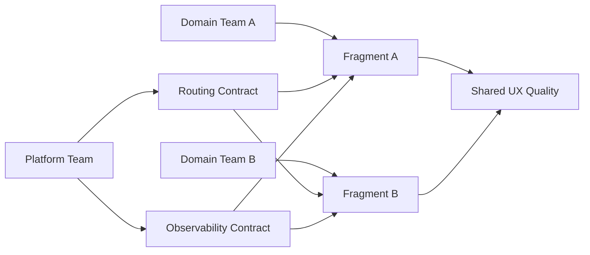

이 시리즈의 마지막 주제는 구현이 아니라 운영입니다. 왜냐하면 MFE 환경에서 Router + RSC의 성공 여부는 기술 선택보다 운영 모델에서 결정되기 때문입니다.

같은 코드를 써도 어떤 조직은 안정적으로 확장하고, 어떤 조직은 반복적으로 장애를 겪습니다. 차이는 명확합니다.

- 경계가 계약으로 관리되는가
- 소유권이 명시돼 있는가
- 관측성과 의사결정 루프가 작동하는가

이 글은 30인 규모 팀/MFE 전환 맥락에서 React Router v7 + RSC를 "지속 가능한 운영 패턴"으로 정착시키는 방법을 다룹니다.

---

## 왜 MFE + RSC 조합은 운영 난이도가 급상승하는가

MFE는 원래 경계가 많습니다.

- 조직 경계 (팀)
- 코드 경계 (repo/package)
- 배포 경계 (release train)
- UX 경계 (페이지/섹션)

RSC를 추가하면 서버/클라이언트 경계까지 늘어납니다. 경계가 많아질수록 기술 문제가 아니라 계약 문제가 됩니다. 즉 "어떻게 만든다"보다 "누가 무엇을 책임진다"가 먼저 정해져야 합니다.

---

## 1) Shell vs Fragment 책임 계약을 먼저 고정한다

가장 먼저 해야 할 것은 책임 분리입니다.

### Shell 책임
- 글로벌 URL 계약
- 인증/권한 게이트
- 공통 Error/Pending 정책
- 공통 observability 스키마

### Fragment 책임
- 도메인 라우트 내부 흐름
- 도메인 데이터 read/write 경계
- 도메인 특화 UX fallback

이 분리가 없으면 장애시 채널에서 가장 먼저 나오는 질문이 "이거 누구 이슈냐"가 됩니다.

---

## 2) 데이터 소유권을 리소스 단위로 문서화한다

MFE + Router + RSC에서 가장 빈번한 충돌은 데이터 소유권입니다.

리소스마다 다음 4가지를 고정합니다.

1. Read owner (RSC/loader)
2. Write owner (action)
3. Revalidation owner
4. Fallback owner

이 문서가 없으면 팀마다 "우리 기준"이 생기고, 통합 시 충돌이 폭발합니다.

---

## 3) 플랫폼 가드레일을 최소한으로 강제한다

자율성을 유지하려면 공통 표준이 필요합니다. 최소 가드레일은 다음이 현실적입니다.

- route naming 규칙
- boundary 인터페이스 규약
- logging schema
- transition 성능 측정 규격
- rollback playbook 형식

가드레일이 없는 자율성은 확장 시 품질 분산을 키웁니다.

---

## 4) RFC 기반 경계 변경 프로세스

경계 변경은 단순 PR이 아니라 운영 변경입니다. RFC를 기본 루프로 삼아야 합니다.

권장 루프:
1. 경계 변경 제안(RFC)
2. 소유팀 리뷰
3. 제한 트래픽 실험
4. 지표 검증
5. 표준 반영

이 루프가 있으면 "큰 설계"를 한 번에 밀어붙이지 않고 안전하게 진화할 수 있습니다.

---

## 5) 관측성: 기술 로그가 아니라 운영 로그로 설계

문제가 생겼을 때 필요한 건 stack trace만이 아닙니다. 운영 의사결정에 필요한 필드가 있어야 합니다.

권장 필드:
- routeId
- fragmentId
- ownerTeam
- sourcePath(RSC/loader/action)
- boundaryId
- revalidationReason
- userImpactScope

이 필드가 있으면 장애 회고가 감정이 아니라 데이터 기반으로 진행됩니다.

---

## 6) 팀 구조와 배포 구조를 맞춘다

많은 조직이 놓치는 포인트입니다. 코드 경계와 팀 경계가 다르면 항상 병목이 생깁니다.

권장:
- 팀 소유 범위를 route/fragment 경계와 정렬
- release authority를 소유권과 정렬
- cross-team dependency를 명시적으로 추적

정렬이 안 되면, 기술적으로는 모듈화돼도 운영은 중앙집중 병목으로 돌아갑니다.

---

## 7) 실패 패턴에서 배우는 운영 규칙

### 패턴 A: Shell이 모든 정책을 독점

단기적으로는 일관성이 좋아 보이지만, 도메인 팀 속도가 급격히 떨어집니다.

### 패턴 B: Fragment가 공통 정책을 무시

팀별로 UX/로깅/에러 처리 품질이 갈라져 사용자 경험이 분열됩니다.

### 패턴 C: 문서 없는 빠른 확장

초기엔 빨라 보여도 장애 대응에서 크게 지불합니다.

---

## 운영 다이어그램

이 모델의 핵심은 중앙 통제와 팀 자율성의 균형입니다.

---

## 최종 체크리스트

- [ ] Shell/Fragment 책임 계약이 문서화됐는가
- [ ] 리소스 단위 소유권(읽기/쓰기/재검증/복구)이 정의됐는가
- [ ] RFC 루프가 실제로 작동하는가
- [ ] 관측성 필드가 운영 의사결정에 충분한가
- [ ] 팀 경계와 라우트 경계가 정렬되어 있는가
- [ ] rollback playbook이 리허설됐는가

---

## 시리즈 결론

RSC 시대의 React Router v7은 라우팅 도구를 넘어 경계 운영 도구가 됩니다. 구현은 시작일 뿐이고, 성공은 운영 모델에서 결정됩니다.

정리하면:

- RSC는 렌더링 전략
- Router는 경계 전략
- MFE 성공은 운영 전략

세 가지가 정렬될 때만 규모가 커져도 품질이 유지됩니다.
