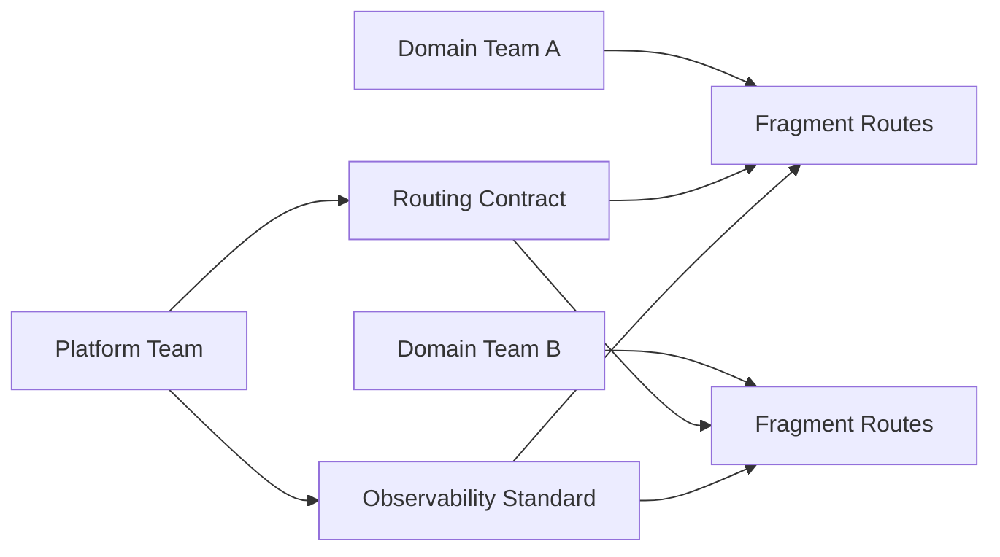

시리즈 마지막 글입니다.
여기서는 기술 개념보다 운영 패턴에 집중합니다.

질문은 하나입니다.

> 30인 규모, MFE 전환 조직에서 Router + RSC를 어떻게 "지속 가능한 운영 모델"로 만들 것인가?

---

## 1) Shell과 Fragment의 라우팅 책임 분리

가장 먼저 정해야 할 것은 책임 경계입니다.

- Shell 책임
  - 전역 URL 계약
  - 공통 레이아웃/인증/에러 정책
  - 공통 관측성(로그/트레이스)

- Fragment 책임
  - 도메인 라우트 내부 전환
  - 도메인 데이터 경계
  - 도메인 특화 Pending/Error UX

이 분리가 없으면 팀 간 충돌이 상시화됩니다.

---

## 2) 데이터 소유권 계약

RSC와 loader/action이 혼합되면 소유권 충돌이 더 쉽게 발생합니다.
도메인별 계약 문서를 두고 최소한 아래를 고정해야 합니다.

- 데이터 원천(Source of Truth)
- 재검증 트리거
- 캐시 무효화 책임자
- 장애 시 우선 복구 순서

---

## 3) 공통 운영 규격(플랫폼 가드레일)

플랫폼 팀이 강제해야 할 최소 규격:

- 라우트 네이밍/폴더 컨벤션
- ErrorBoundary 인터페이스
- Pending UI 패턴
- 전환 성능 지표 수집 포맷

이 가드레일이 있어야 팀 자율성과 일관성이 동시에 유지됩니다.

---

## 4) 의사결정 프로세스

기술 선택보다 의사결정 루프가 중요합니다.

권장 루프:
1. RFC(경계 변경 제안)
2. 소유팀 리뷰
3. 실험 라우트 적용
4. 지표 검증
5. 표준 반영

---

## 운영 다이어그램

---

## 최종 체크리스트

- [ ] Shell/Fragment 책임이 문서로 합의됐는가
- [ ] 데이터 소유권 충돌을 조정할 프로세스가 있는가
- [ ] Error/Pending 패턴이 팀 공통 규격으로 존재하는가
- [ ] 라우트 전환 성능/장애 지표가 일관되게 수집되는가
- [ ] 경계 변경 시 RFC 루프가 작동하는가

---

## 시리즈 마무리

RSC 시대의 React Router v7은 "라우팅 라이브러리"를 넘어, 경계와 운영을 연결하는 도구입니다.
기술 도입만으로는 성공할 수 없고, 팀 운영 모델과 함께 설계해야 실제 품질이 올라갑니다.

이 시리즈의 요지는 하나입니다.

> **RSC는 렌더링 전략이고, Router는 운영 가능한 경계 전략이다.**
