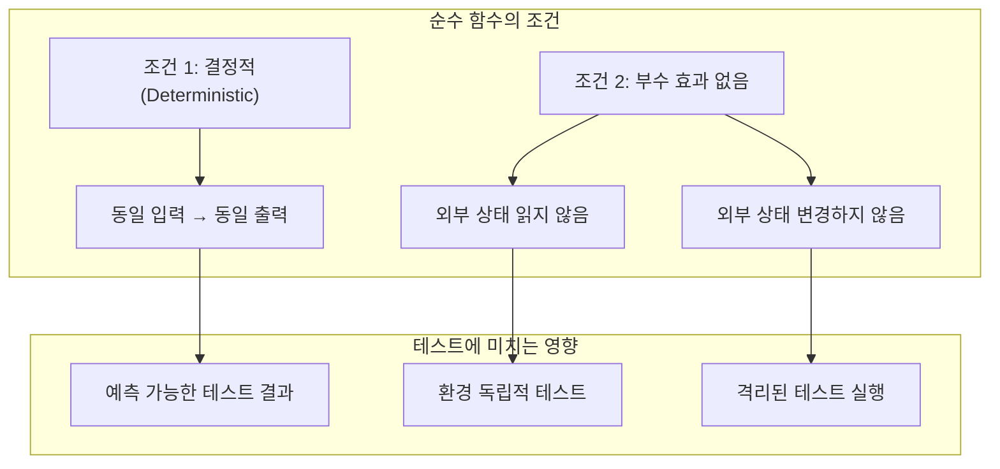
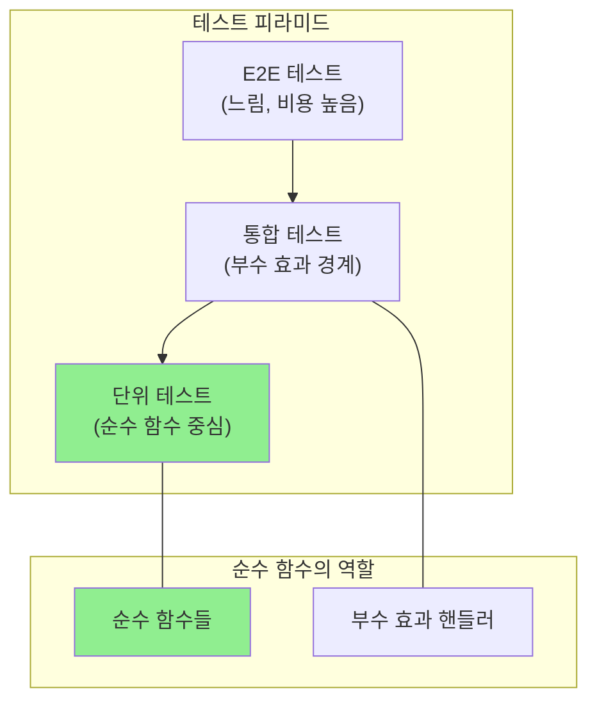

# 순수 함수와 테스트: 왜 순수성이 테스트 가능성을 결정하는가

## 한눈에 보기

순수 함수는 동일한 입력에 대해 항상 동일한 출력을 반환하고, 외부 상태를 변경하지 않는 함수입니다. 이러한 특성은 테스트를 극적으로 단순화합니다. 모킹 없이 입력-출력만 검증하면 되기 때문입니다. 이 글에서는 순수 함수가 테스트 용이성을 높이는 이유를 람다 대수와 참조 투명성의 관점에서 탐구하고, 실무에서 순수 함수 기반 테스트 패턴을 적용하는 방법을 살펴봅니다.

---

## 들어가며

소프트웨어 테스트에서 가장 어려운 부분은 무엇일까요? 많은 개발자들이 "모킹(mocking)"이라고 답합니다. 데이터베이스 연결을 모킹하고, API 호출을 스텁으로 대체하고, 파일 시스템 접근을 가상화하는 작업은 때로 테스트 대상 코드보다 더 복잡해집니다.

그런데 흥미로운 사실이 있습니다. 어떤 함수들은 이런 모킹이 전혀 필요하지 않습니다. 입력값만 넣어주면 예상한 출력이 나오는지 확인하면 됩니다. 이런 함수들의 공통점은 무엇일까요?

그것은 **순수성(purity)**입니다.

순수 함수는 테스트를 단순하게 만듭니다. 하지만 그것이 "왜" 그런지, 그 근본적인 이유를 이해하면 더 나은 테스트 전략을 설계할 수 있습니다. 이 글에서는 순수 함수가 테스트를 어떻게 변화시키는지, 그 이론적 기반부터 실무 적용까지 탐구합니다.

---

## 순수 함수란 무엇인가: 수학적 함수의 개념으로 돌아가기

순수 함수를 이해하려면 수학에서의 함수 개념으로 돌아가야 합니다. 수학에서 함수 `f(x) = x + 1`은 특별한 속성을 가집니다. `f(2)`는 언제 어디서 계산하든 항상 `3`입니다. 오전에 계산해도, 오후에 계산해도, 다른 컴퓨터에서 계산해도 결과는 같습니다.

이것이 **참조 투명성(Referential Transparency)**입니다. 1930년대 알론조 처치(Alonzo Church)가 정립한 람다 대수에서 유래한 이 개념은, 표현식을 그 값으로 대체해도 프로그램의 동작이 변하지 않음을 의미합니다.

프로그래밍에서 순수 함수는 이 수학적 함수의 특성을 따릅니다.

### 순수 함수의 두 가지 조건



1. **결정적(Deterministic)**: 동일한 입력에 대해 항상 동일한 출력을 반환합니다
2. **부수 효과 없음(No Side Effects)**: 함수 외부의 상태를 읽거나 변경하지 않습니다

이 두 조건이 만족될 때, 함수는 "순수"하며, 테스트는 극적으로 단순해집니다.

---

## 참조 투명성이 테스트를 단순하게 만드는 이유

참조 투명성은 단순한 학술적 개념이 아닙니다. 이것이 테스트에 미치는 영향은 실질적입니다.

### 비순수 함수의 테스트 문제

```typescript
// 비순수 함수: 전역 상태에 의존
let featureDatabase: Feature[] = [];

function generateFeatureList(): Feature[] {
  const features: Feature[] = [];
  featureDatabase.forEach(item => {
    features.push(item);     // 외부 상태 참조
    logEvent(item);          // 부수 효과
  });
  return features;
}
```

이 함수를 테스트하려면 어떻게 해야 할까요?

1. `featureDatabase` 전역 변수를 테스트 전에 설정해야 합니다
2. `logEvent`를 모킹하거나 스파이해야 합니다
3. 테스트 후 전역 상태를 원래대로 복원해야 합니다
4. 다른 테스트와 격리하기 위해 병렬 실행을 포기해야 할 수 있습니다

```typescript
// 테스트 코드 - 복잡한 셋업 필요
describe('generateFeatureList', () => {
  let originalDatabase: Feature[];
  let logEventMock: jest.Mock;

  beforeEach(() => {
    originalDatabase = featureDatabase;
    featureDatabase = [{ id: 1, category: 'ui' }];
    logEventMock = jest.fn();
    global.logEvent = logEventMock;
  });

  afterEach(() => {
    featureDatabase = originalDatabase;
  });

  it('returns features from database', () => {
    const result = generateFeatureList();
    expect(result).toHaveLength(1);
    expect(logEventMock).toHaveBeenCalled();
  });
});
```

### 순수 함수의 테스트 단순성

```typescript
// 순수 함수: 모든 의존성이 매개변수로 전달
function filterFeaturesByCategory(
  features: Feature[],
  category: string
): Feature[] {
  return features.filter(f => f.category === category);
}
```

이 함수의 테스트는 어떻게 달라질까요?

```typescript
// 테스트 코드 - 단순함
describe('filterFeaturesByCategory', () => {
  it('returns only features matching category', () => {
    const features = [
      { id: 1, category: 'ui' },
      { id: 2, category: 'api' },
      { id: 3, category: 'ui' }
    ];

    const result = filterFeaturesByCategory(features, 'ui');

    expect(result).toEqual([features[0], features[2]]);
  });

  it('returns empty array for non-matching category', () => {
    const features = [{ id: 1, category: 'ui' }];
    const result = filterFeaturesByCategory(features, 'database');
    expect(result).toEqual([]);
  });
});
```

**모킹이 필요 없습니다. 셋업/티어다운이 필요 없습니다. 공유 상태가 없습니다.**

참조 투명성 덕분에, 함수 호출 `filterFeaturesByCategory(features, 'ui')`는 그 결과값으로 대체할 수 있습니다. 이것이 테스트를 예측 가능하고 재현 가능하게 만드는 핵심입니다.

---

## 순수 함수와 테스트 피라미드

테스트 피라미드는 단위 테스트를 기반으로 통합 테스트, E2E 테스트로 올라가는 구조입니다. 순수 함수는 이 피라미드의 가장 아래 층, 즉 단위 테스트를 풍부하게 만들어줍니다.



순수 함수로 비즈니스 로직을 작성하면, 단위 테스트의 비중을 높일 수 있습니다. 단위 테스트는 빠르고, 안정적이며, 실행 비용이 낮습니다. 이것이 테스트 피라미드가 권장하는 구조입니다.

---

## 비순수 함수를 순수 함수로 전환하는 패턴

실제 애플리케이션에서 모든 코드를 순수 함수로 작성할 수는 없습니다. 데이터베이스 접근, API 호출, 파일 시스템 조작은 필연적으로 부수 효과를 수반합니다. 그러나 **비즈니스 로직**은 순수 함수로 분리할 수 있습니다.

### 패턴 1: 변환 로직 추출

```typescript
// Before: 입력을 변경하는 비순수 함수
function addMetadata(features: Feature[]): Feature[] {
  features.forEach(f => {
    f.timestamp = Date.now();  // 입력 변경
    f.version = 2;             // 입력 변경
  });
  return features;
}

// After: 새로운 객체를 반환하는 순수 함수
function withMetadata(
  features: Feature[],
  timestamp: number  // 시간도 매개변수로
): Feature[] {
  return features.map(f => ({
    ...f,
    timestamp,
    version: 2
  }));
}
```

### 패턴 2: 의존성 주입

```typescript
// Before: 전역 설정에 의존
const GLOBAL_CONFIG = { minPriority: 5 };

function processFeatures(features: Feature[]): Feature[] {
  return features.filter(f => f.priority > GLOBAL_CONFIG.minPriority);
}

// After: 설정을 매개변수로 주입
function processFeatures(
  features: Feature[],
  config: { minPriority: number }
): Feature[] {
  return features.filter(f => f.priority > config.minPriority);
}
```

### 패턴 3: Functional Core, Imperative Shell

Gary Bernhardt가 제안한 "Functional Core, Imperative Shell" 패턴은 순수 함수 기반 테스트 전략의 정수입니다.

```typescript
// Functional Core - 순수 함수들
function calculateDiscount(price: number, userTier: string): number {
  const discountRates = { gold: 0.2, silver: 0.1, bronze: 0.05 };
  return price * (discountRates[userTier] || 0);
}

function applyDiscount(price: number, discount: number): number {
  return Math.max(0, price - discount);
}

// Imperative Shell - 부수 효과 처리
async function processOrder(orderId: string): Promise<void> {
  // I/O: 데이터 가져오기
  const order = await database.getOrder(orderId);
  const user = await database.getUser(order.userId);

  // Pure: 계산
  const discount = calculateDiscount(order.total, user.tier);
  const finalPrice = applyDiscount(order.total, discount);

  // I/O: 결과 저장
  await database.updateOrder(orderId, { finalPrice });
  await emailService.sendReceipt(user.email, finalPrice);
}
```

이 구조에서:
- `calculateDiscount`와 `applyDiscount`는 순수 함수로, 단위 테스트가 간단합니다
- `processOrder`는 부수 효과를 처리하며, 통합 테스트로 검증합니다

---

## 순수 함수 테스트와 속성 기반 테스트

순수 함수의 또 다른 장점은 **속성 기반 테스트(Property-Based Testing)**와의 시너지입니다.

전통적인 예시 기반 테스트는 특정 입력에 대한 특정 출력을 검증합니다.

```typescript
it('filters by category', () => {
  expect(filterFeaturesByCategory([{ id: 1, category: 'ui' }], 'ui'))
    .toHaveLength(1);
});
```

속성 기반 테스트는 "어떤 입력이든 이 속성이 만족되어야 한다"를 검증합니다.

```typescript
// fast-check 라이브러리 사용
import * as fc from 'fast-check';

it('filtered result is subset of input', () => {
  fc.assert(
    fc.property(
      fc.array(fc.record({ id: fc.nat(), category: fc.string() })),
      fc.string(),
      (features, category) => {
        const result = filterFeaturesByCategory(features, category);
        // 속성: 결과는 항상 입력의 부분집합
        return result.every(r => features.includes(r));
      }
    )
  );
});

it('all results match the category', () => {
  fc.assert(
    fc.property(
      fc.array(fc.record({ id: fc.nat(), category: fc.string() })),
      fc.string(),
      (features, category) => {
        const result = filterFeaturesByCategory(features, category);
        // 속성: 모든 결과의 카테고리가 일치
        return result.every(r => r.category === category);
      }
    )
  );
});
```

순수 함수이기 때문에 수천 개의 무작위 입력을 생성해도 테스트가 결정적으로 동작합니다. 비순수 함수에서는 이런 테스트가 불가능합니다.

---

## 트레이드오프

순수 함수 기반 테스트 전략은 강력하지만, 모든 상황에 적합한 것은 아닙니다.

| 측면 | 장점 | 한계 |
|------|------|------|
| **테스트 복잡도** | 모킹 불필요, 단순한 입출력 검증 | 순수/비순수 경계 설계 필요 |
| **테스트 속도** | 빠른 단위 테스트 | - |
| **병렬 실행** | 공유 상태 없어 안전 | - |
| **디버깅** | 재현 가능한 버그 | - |
| **코드 구조** | 명확한 책임 분리 강제 | 초기 설계 비용 증가 |
| **성능** | 불변 데이터로 인한 메모리 오버헤드 가능 | 대용량 데이터 처리 시 주의 |
| **학습 곡선** | - | 함수형 패러다임 이해 필요 |

### 순수 함수가 적합한 영역

- 데이터 변환 및 가공 로직
- 유효성 검증 함수
- 비즈니스 규칙 계산
- 포맷팅 및 표시 로직

### 비순수 함수가 불가피한 영역

- 데이터베이스 I/O
- 네트워크 통신
- 파일 시스템 접근
- 사용자 입력 처리
- 로깅 및 모니터링

핵심은 **비즈니스 로직을 순수 함수로, I/O를 비순수 셸로** 분리하는 것입니다.

---

## 마무리하며

1930년대 알론조 처치가 람다 대수를 정립했을 때, 그는 소프트웨어 테스트를 생각하지 않았을 것입니다. 그러나 그가 정의한 참조 투명성 개념은 90년 뒤인 오늘날, 테스트 가능한 소프트웨어를 설계하는 핵심 원칙이 되었습니다.

순수 함수가 테스트를 단순하게 만드는 이유는 명확합니다.

1. **예측 가능성**: 동일 입력, 동일 출력으로 테스트 결과가 결정적입니다
2. **격리**: 외부 의존성이 없어 테스트 간 간섭이 없습니다
3. **재현성**: 언제 어디서 실행해도 같은 결과를 얻습니다

테스트하기 어려운 코드를 만났을 때, "이 함수가 순수한가?"라고 물어보십시오. 순수하지 않다면, 순수한 부분을 추출할 수 있는지 고민해 보십시오. 그것이 테스트 가능한 코드로 가는 첫 걸음입니다.

> "테스트하기 어려운 코드는 설계가 잘못된 코드다."

이 격언은 순수 함수의 관점에서 다시 해석할 수 있습니다.

> "테스트하기 어려운 코드는 순수하지 않은 부분과 비즈니스 로직이 뒤섞인 코드다."

순수 함수와 비순수 셸을 분리하면, 비즈니스 로직은 테스트하기 쉬워지고, 부수 효과는 명확한 경계에서 관리됩니다. 이것이 순수 함수 기반 테스트 전략의 핵심 통찰입니다.

---

## 더 읽어볼 자료

- [Referential Transparency - Wikipedia](https://en.wikipedia.org/wiki/Referential_transparency) - 참조 투명성의 학술적 배경
- [Gary Bernhardt - Boundaries (Talk)](https://www.destroyallsoftware.com/talks/boundaries) - Functional Core, Imperative Shell 패턴 설명
- [Property-Based Testing with fast-check](https://github.com/dubzzz/fast-check) - JavaScript/TypeScript 속성 기반 테스트
- [Haskell Wiki - Pure Functions](https://wiki.haskell.org/Functional_programming) - 순수 함수의 원조인 Haskell 관점
- [Martin Fowler - Mocks Aren't Stubs](https://martinfowler.com/articles/mocksArentStubs.html) - 테스트 더블의 이해
- [Eric Elliott - Composing Software](https://medium.com/javascript-scene/composing-software-the-book-f31c77fc3ddc) - JavaScript에서의 함수형 프로그래밍

